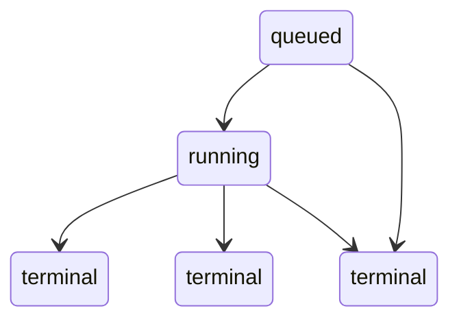

# Concurrency Spec (LocalBackend + TaskStore + Telemetry)

This document defines concurrency invariants, allowed status transitions, lock locations, and platform behavior for the Overseer local-first execution backend.

## Invariants

1. **No metadata corruption**: `codex/08_TELEMETRY/runs/<run_id>/meta.json` is always well-formed JSON with the expected keys; it is never partially written (atomic write via temp file + replace).

2. **No run status regression**: Status transitions follow the allowed DAG below. A later write cannot move a run backwards (e.g. from `canceled` to `done`). Worker finalization re-reads under lock and applies only allowed transitions.

3. **Run isolation**: Two concurrent runs never write into each other's directories, logs, or worktrees. Each run uses:
   - Telemetry dir: `codex/08_TELEMETRY/runs/<run_id>/`
   - Worktree dir: `codex/10_OVERSEER/worktrees/<run_id>/`
   - Execution lock: per-run (`codex/10_OVERSEER/locks/<run_id>.lock`), not per-task.

4. **Atomic run directory creation**: Creating `runs/<run_id>/` and `worktrees/<run_id>/` is race-safe under concurrent submissions. If a worktree path already exists for a given `run_id`, creation raises instead of reusing (caller must use a new run id).

5. **TaskStore safety**: Concurrent updates do not lose tasks or clobber statuses due to read-modify-write races. The task graph file is never observed partially written (atomic rewrite via temp + replace; all access under a single file lock).

## Allowed status transitions (run meta.json)

- **queued** → running | canceled  
- **running** → done | failed | canceled  
- **done**, **failed**, **canceled** are terminal (no outgoing transitions).

## Lock paths and names

| Resource | Lock path | Scope |
|----------|-----------|--------|
| Run meta.json read/write | `codex/08_TELEMETRY/runs/<run_id>/meta.lock` | Per run |
| Execution (stdout/stderr) | `codex/10_OVERSEER/locks/<run_id>.lock` | Per run |
| Task graph (TASK_GRAPH.jsonl) | `codex/10_OVERSEER/locks/task_graph.lock` | Global |
| Git worktree creation | `codex/10_OVERSEER/locks/git_worktree.lock` | Global |
| Human queue append | `codex/10_OVERSEER/locks/human_queue.lock` | Global |
| Run log append | `codex/10_OVERSEER/locks/run_log.lock` | Global |

## Contention behavior

- **Acquisition**: Blocking with poll (non-blocking try in a loop). Default timeout 30s, poll interval 0.1s.
- **On timeout**: `TimeoutError` is raised; caller should not retry the same operation indefinitely without backoff or user feedback.
- **Release**: Lock is released when the context manager exits (normal or exceptional).

## Cross-platform notes

- **Linux / WSL (primary)**: Uses `fcntl.flock(LOCK_EX | LOCK_NB)` for advisory file locking. Safe for multi-process and multi-thread use when all writers/readers use the same lock path.
- **Windows**: Uses `msvcrt.locking(fd, LK_NBLCK, 1)` in the same poll loop; behavior is blocking-with-timeout. Not primary target; best-effort for compatibility.
